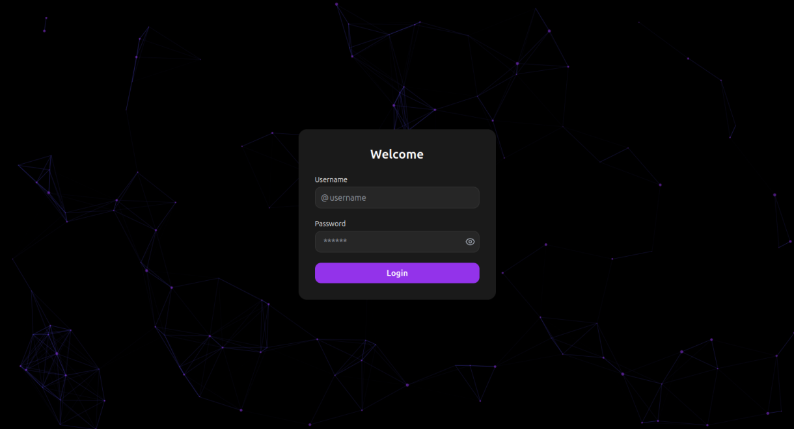
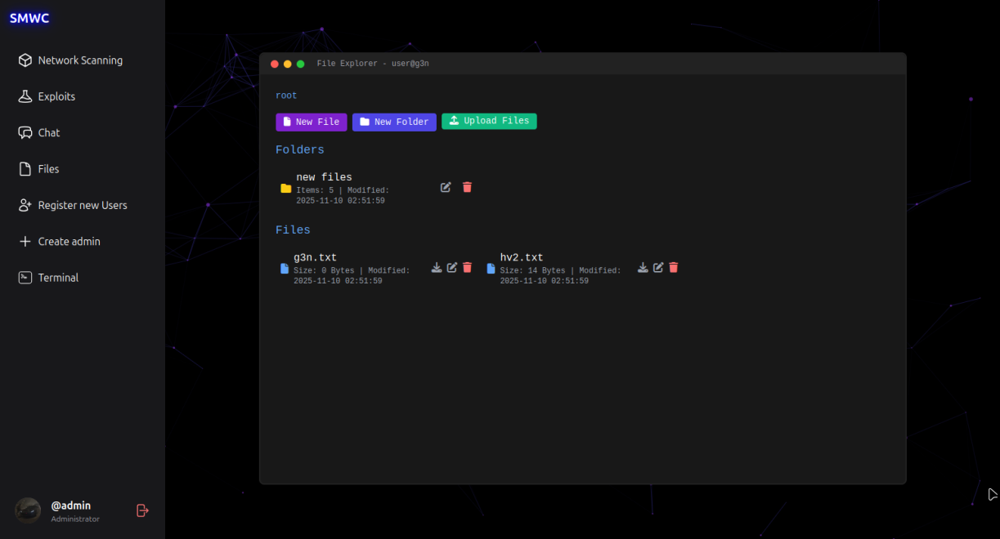
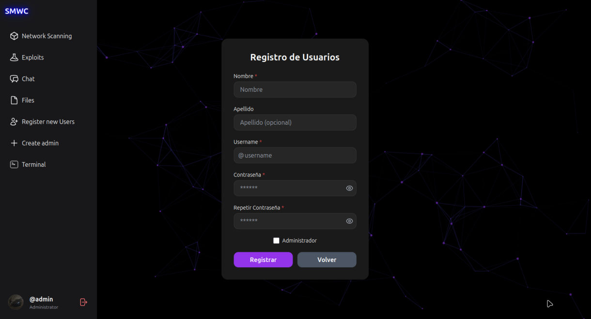
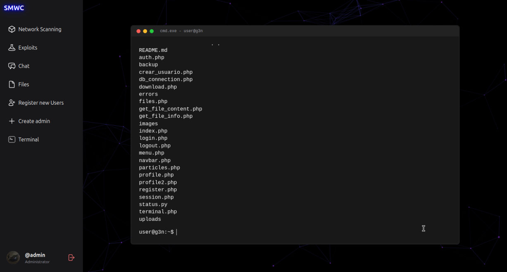
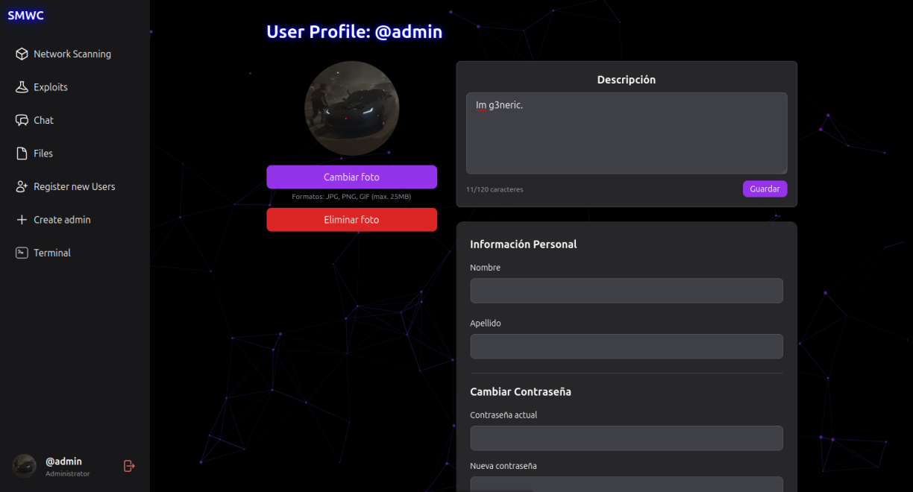

# 🌐 SMWC (Server Management & Web Control)  

⚠️ **Current status:** *In development, some features may NOT work correctly.*  
⚠️ **Version:** *Beta v1.0.0*

✨ **SMWC** is a platform designed for **personal server management and control**, offering an intuitive interface where you can **upload, download, edit, and play** various types of files (text, code, videos, photos, music, etc.).


---

## 📌 Main Features  

| Feature | Status | Description |
|----------|---------|-------------|
| 📤 **File Upload** | ✅ | Upload files to the server |
| 📥 **File Download** | ✅ | Download files from the server |
| 🎬 **Media Player** | ✅ | Play videos, music, and images |
| 📁 **Folder Creation** | ✅ | Organize files into folders |
| 📝 **File Editor** | ✅ | Built-in text and code editor |
| 👥 **User Management** | 🚫 | Add, remove, or block users (admin, user, guest) |
| 👤 **Custom Profiles** | ✴️ | User profiles with photo, description, and password change |
| 💬 **Live Chat** | 🚫 | Real-time chat between users |
| 🔐 **Protected Folders** | 🚫 | Password-protected directories |
| 💬 **Forums** | 🚫 | Internal discussion forums |
| 📊 **Server Monitor** | ✅ | Live CPU, RAM, and storage stats |
| 💻 **Server Shell** | ✅ | Access to the server terminal |
| ⚙️ **Server Control** | 🚫 | Power on, off, or restart the server |
| 🗿 **Easy Setup** | 🚫 | Simple installation and configuration |

---

## 🖼️ Screenshots

<div align="center">
<table>
  <tr>
    <td></td>
    <td></td>
  </tr>
  <tr>
    <td align="center"><i>Login</i></td>
    <td align="center"><i>Main Dashboard</i></td>
  </tr>
  <tr>
    <td></td>
    <td></td>
  </tr>
  <tr>
    <td align="center"><i>File Manager</i></td>
    <td align="center"><i>Register</i></td>
  </tr>
  <tr>
    <td></td>
    <td></td>
  </tr>
  <tr>
    <td align="center"><i>Terminal</i></td>
    <td align="center"><i>User Profile</i></td>
  </tr>
</table>
</div>

---

## 🧩 Development Progress  

- **Completed (✅):** `Easy Setup`  
- **In Progress (✴️):** `User Management`, `Custom Profiles`  
- **Pending (🚫):** All other features  

---

## 🚀 Project Goals  

- Build a **light, powerful tool** for personal server management  
- Provide a **modern, responsive web panel** accessible from any device  
- Ensure **security and privacy** through user roles and protected folders  

---

## 🛠️ Installation (Coming Soon)  

```bash
Not ready yet.

```


